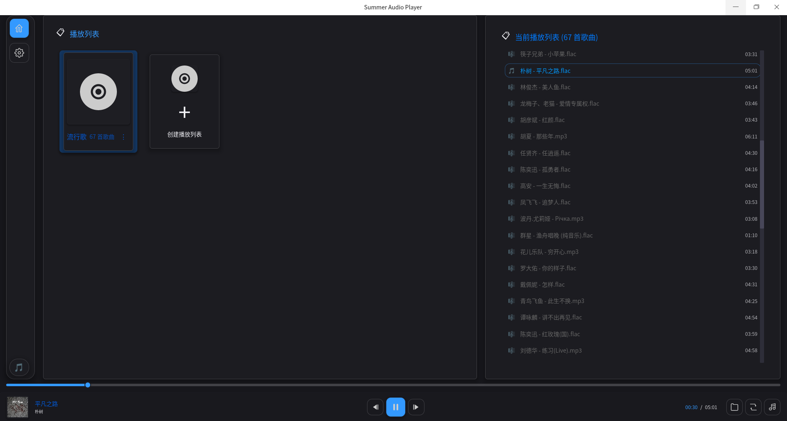
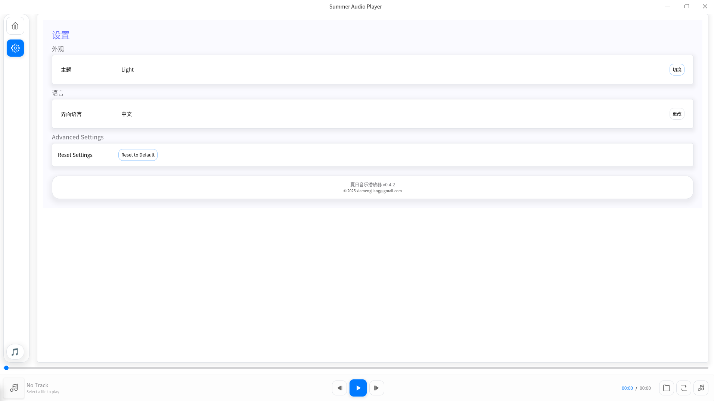

# Summer Player - 夏日音频播放器

一个使用Rust编写的现代化图形界面音频播放器，带有夏日主题，使用iced GUI框架构建。

## 效果图






## 功能特性

- 🎵 **多格式支持**: 支持MP3、FLAC、WAV、OGG、AAC、M4A、M4S等多种音频格式
- 📋 **播放列表支持**: 支持M3U/M3U8播放列表格式
- 🎨 **现代GUI**: 使用iced框架构建的美观现代化界面
- 🌞 **夏日主题**: 温暖舒适的夏日色彩主题
- 🎨 **主题切换**: 支持浅色(Light)和深色(Dark)主题
- 🌍 **多语言支持**: 支持中文和英文界面，自动检测系统语言
- 🧭 **导航侧边栏**: 清晰的页面导航和现代化布局
- 📁 **文件选择**: 内置文件选择器，支持多种音频格式过滤
- ⏯️ **播放控制**: 播放、暂停、停止功能
- ⏮️⏭️ **播放列表控制**: 上一首、下一首切换
- 📊 **进度显示**: 显示播放进度条和时间信息，支持拖拽跳转
- 🎤 **歌词支持**: 支持LRC格式歌词文件显示
- ⚙️ **设置页面**: 完整的设置界面，支持主题和语言配置

## 依赖库

- **iced**: 图形用户界面框架
- **symphonia**: 音频解码库
- **cpal**: 跨平台音频库
- **rfd**: 文件对话框库
- **clap**: 命令行参数解析
- **rust-i18n**: 国际化支持
- **sys-locale**: 系统语言检测

## 编译和运行

### 系统要求

- Rust 1.70+
- Linux/Windows/macOS

### 编译依赖

**Linux (Debian/Ubuntu)**:
```bash
# 安装 Rust 工具链
curl --proto '=https' --tlsv1.2 -sSf https://sh.rustup.rs | sh

# 安装系统依赖
sudo apt update
sudo apt install -y build-essential pkg-config libasound2-dev libfontconfig1-dev libxkbcommon-dev
```

**其他 Linux 发行版**:
- **Fedora/RHEL**: `sudo dnf install alsa-lib-devel fontconfig-devel libxkbcommon-devel`
- **Arch Linux**: `sudo pacman -S alsa-lib fontconfig libxkbcommon`
- **openSUSE**: `sudo zypper install alsa-devel fontconfig-devel libxkbcommon-devel`

**macOS**:
```bash
# 安装 Xcode 命令行工具
xcode-select --install

# 使用 Homebrew 安装依赖（可选）
brew install pkg-config
```

**Windows**:
- 安装 [Microsoft C++ Build Tools](https://visualstudio.microsoft.com/visual-cpp-build-tools/)
- 或安装 Visual Studio with C++ 支持

### 编译

```bash
cargo build --release
```

### 构建 deb 包

如果你想创建 Debian/Ubuntu 安装包：

```bash
# 安装 cargo-deb
cargo install cargo-deb

# 构建 deb 包
cargo deb

# 生成的包位于：target/debian/summer-player_0.4.0-1_amd64.deb
```

**安装 deb 包**:
```bash
sudo dpkg -i target/debian/summer-player_0.4.0-1_amd64.deb

# 如果有依赖问题，运行：
sudo apt-get install -f
```

### 运行

**图形界面模式**:
```bash
cargo run
```

**指定音频文件**:
```bash
cargo run -- path/to/audio/file.mp3
```

**命令行选项**:
```bash
# 显示帮助
cargo run -- --help

# 列出可用的音频输出设备
cargo run -- --list-devices

# 查看音频文件信息
cargo run -- --info path/to/audio/file.mp3
```

## 开发计划

### 已完成 ✅
- [x] 实现真正的音频播放功能
- [x] 添加播放列表功能
- [x] 统一错误处理系统
- [x] 完善文档和注释
- [x] 添加播放进度条拖拽跳转功能
- [x] 添加Light和Dark主题
- [x] 添加多语言国际化
- [x] 添加设置页面
- [x] 重构UI布局，增加导航侧边栏
- [x] 添加歌词显示功能
- [x] 添加播放模式（循环、随机等）
- [x] 调整歌词界面动画方向为上下切换
- [x] 解析文件内嵌歌词信息
- [x] 添加配置文件保存用户配置
- [x] 添加播放列表新建、重命名等编辑功能
- [x] 多播放列表页面视图

### 进行中 🚧
- [ ] 添加更多单元测试
- [ ] 完善主题切换功能

### 计划中 📋
- [ ] 添加音频可视化
- [ ] 添加均衡器
- [ ] 添加拖放文件支持
- [ ] 添加键盘快捷键
- [ ] 添加播放状态实时同步
- [ ] 性能优化和内存使用改进
- [ ] 添加更多语言支持
- [ ] 自动扫描音乐
- [ ] 托盘功能
- [ ] 自动更新检测
- [ ] 添加更多的动画效果
- [ ] 添加id3标签编辑功能

## 许可证

MIT License - 详见LICENSE文件

## 贡献

欢迎提交问题和拉取请求！

---

*使用Rust和iced构建的现代化音频播放器*

## 项目图标

项目包含了一个专门设计的夏日主题图标：
- `icon.svg` - 矢量图标，可无损缩放
- `icon.png` - 128x128像素的PNG图标

图标设计元素：
- 🌞 温暖的夏日色彩（橙色调）
- ▶️ 经典的播放按钮
- 🎵 音符和音波装饰
- ☀️ 太阳光芒效果

## 项目历史
- **v0.5.0**: 重构整个UI布局，统一布局风格，新增播放列表卡片和播放列表编辑功能,iced库切换到0.14版本
- **v0.4.0**: 重构整个UI布局，增加导航侧边栏、多语言支持、主题切换、设置页面
- **v0.3.0**: 重命名为 Summer Player，添加夏日主题和专用图标
- **v0.2.x**: 从TUI迁移到GUI，添加播放列表和歌词支持
- **v0.1.x**: 初始TUI版本 